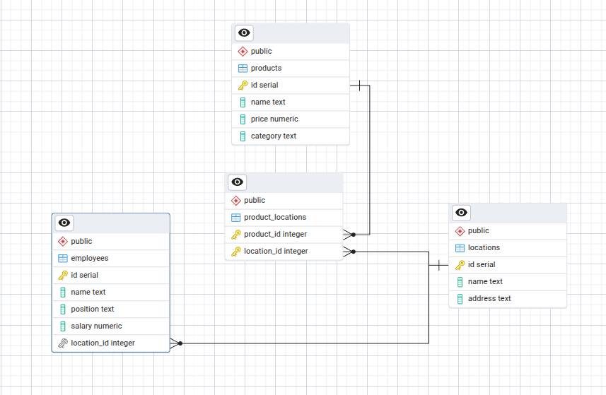
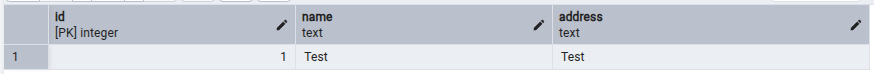

# Store Management Application

This project is a command‑line application in C++ that integrates with a PostgreSQL database using **libpq** (the official C API for PostgreSQL) and **pgAdmin** for databse managment. It manages store **Locations**, **Employees**, and **Products**, and includes unit tests written with **Catch2**.

## Features

- Add and list **Locations** (`id`, `name`, `address`).
- Add and list **Employees** (`id`, `name`, `position`, `salary`, `location_id`).
- Add and list **Products** (`id`, `name`, `price`, `category`).
- Automatic schema initialization

## Database Setup

Before building, you must create and configure your PostgreSQL database and user.
<br>
Make note of your database name (store_db), username (store_user), password (your_password), host (e.g. localhost), and port (default 5432) for the connection string.

## Configuration

Before building, open `main.cpp` (and `test_store.cpp`) and set your connection string:

```cpp
const std::string conninfo =
    "dbname=store_db user=YOUR_USER password=YOUR_PASSWORD host=YOUR_HOST port=YOUR_PORT";
```

Ensure a PostgreSQL database exists and your credentials match.

## Database Schema

Below is the entity-relationship diagram of the database tables:



## Building & Testing

A `Makefile` is provided with these targets:

- `make build` – compile the main application (`store_app`).
- `make run`   – run the application (`./store_app`).
- `make test`  – compile and run the test suite (`test_runner`).
- `make clean` – remove generated binaries.


## Project Layout

```
.
├── test_framework/catch.hpp     # Framework for catch 
├── db.hpp, db.cpp               # Database base class; connection & schema init
├── location.hpp, location.cpp   # Location
├── employee.hpp, employee.cpp   # Employee
├── product.hpp, product.cpp     # Product 
├── main.cpp                     # CLI entry point
├── test_store.cpp               # Catch2 unit tests
├── Makefile                     # Build & test automation
└── README.md                    # README file
```

## Example

<div style="background:#f6f8fa;border-radius:6px;padding:16px;border:1px solid #d0d7de;overflow:auto">

<pre>

Select operation:
 1) Add
 2) List
 0) Exit

Choice: 1

Select entity:
 1) Location
 2) Employee
 3) Product
 0) Back

Choice: 1
Location Name: Test
Address: Test
Location added.

Select operation:
 1) Add
 2) List
 0) Exit

Choice: 2

Select entity:
 1) Location
 2) Employee
 3) Product
 0) Back

Choice: 1

ID: 1, Name: Test, Address: Test
</pre>
</div>

Table's content hown in database after executing the code:



